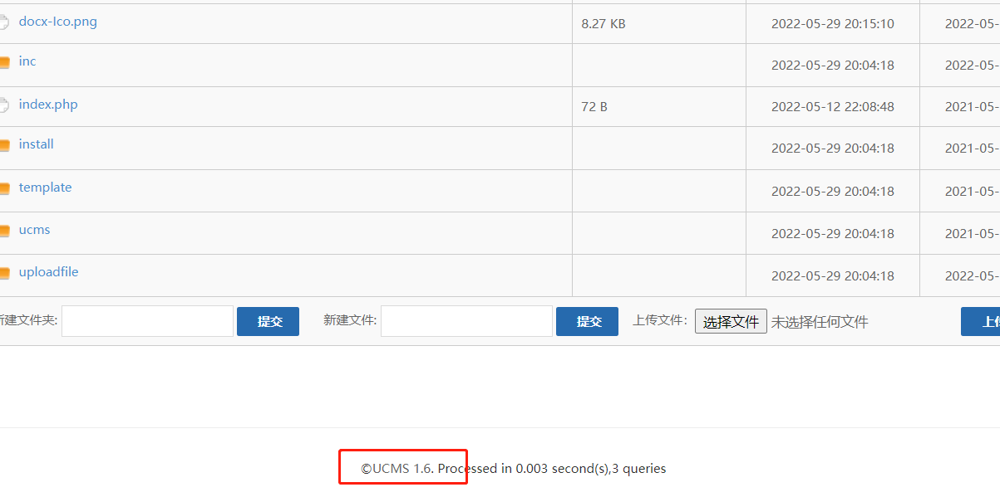
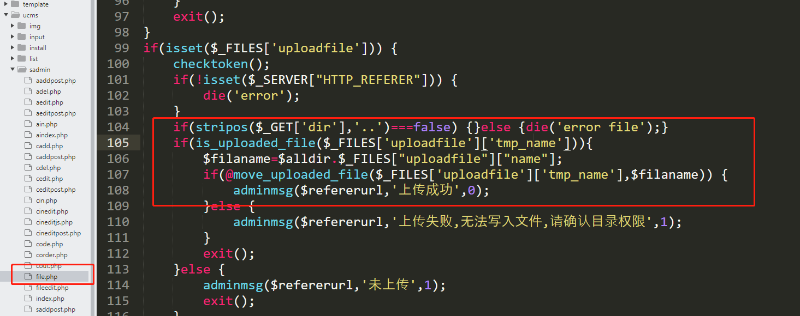
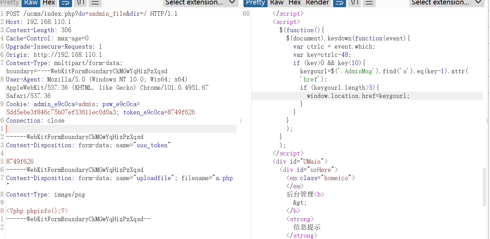
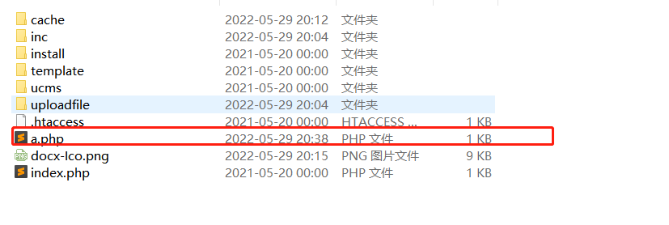
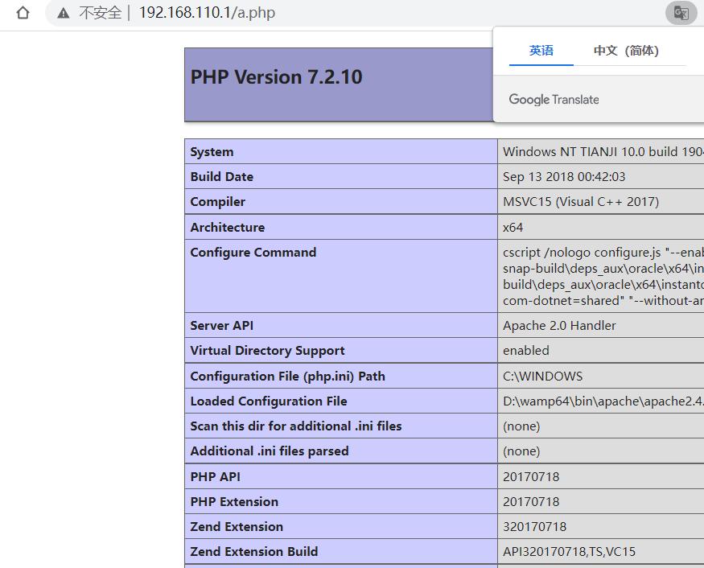

# UCMS v.1.6.0 Unrestricted File Upload

## Vulnerability Type:

Unrestricted File Upload

## Vulnerability Version:

1.6.0

## Recurring environment

* Windows 10
* PHP7.2.0
* Apache 2.4.35

Vulnerability Description And recurrence:

1. The current version is V1.6.0

2. Just search the code, I found the move_uploaded_file() function in the `\UCMS\sadmin\file.php` file, where there are no restrictions on the filename suffix and content to write! When the attacker uploads a malicious PHP script onto the server,this script can then be used to execute arbitrary commands on the server, allowing the attacker to gain full control of it.

3、Just use the following POC，and then you can see that the file has been uploaded successfully。

4. Here our webshell is in a.php. You can find it in the root directory

5. Let's execute a.php。

